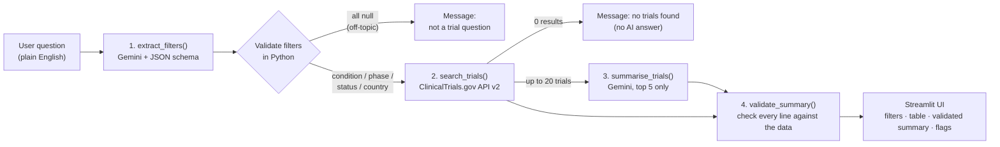

# 🔬 TrialScout

**Ask about clinical trials in plain English. Get real trials from ClinicalTrials.gov and an AI summary that is fact-checked before you see it.**

> Live demo: _add your Streamlit Community Cloud URL here_

TrialScout turns a question like *"Phase 3 diabetes trials recruiting in India"* into a structured search of the official [ClinicalTrials.gov API v2](https://clinicaltrials.gov/data-api/api). It shows the matching trials and writes a short summary of the top 5. Every NCT ID, phase, status and sponsor in that summary is then checked in code against the fetched records. Anything the model invented is removed, and anything it got wrong is flagged.

Built with Python, Google Gemini (`google-genai` SDK), `requests` and Streamlit. There is no LangChain or agent framework: the pipeline is plain Python, so every step is visible and testable.

---

## How it works



| Step | File | What happens |
|---|---|---|
| 1. Extract filters | `src/llm.py` | Gemini returns JSON that must match a schema: `condition`, `phase`, `status`, `country`, each `null` if not mentioned. Python then re-checks every value against the allowed lists. |
| 2. Search | `src/trials_api.py` | The filters become API parameters: `query.cond`, `filter.overallStatus`, and `filter.advanced=AREA[Phase]PHASE3 AND AREA[LocationCountry]India`. Responses are flattened into simple records. |
| 3. Summarise | `src/llm.py` | Only the top 5 trials, as short labelled facts, are sent to Gemini with a "use ONLY this data" prompt and a fixed bullet format. |
| 4. Validate | `src/validation.py` | Each summary line is checked against the fetched records (see below). |
| Orchestrate | `src/pipeline.py` | `run_pipeline()` runs the steps and turns every expected failure into a readable message instead of a crash. |
| UI | `app.py` | Search box, example questions, extracted filters, results table with links, validated summary. |

## How validation works

The summary prompt makes every bullet follow one format, so code can check it:

```
- [NCT07282600] What it studies. Phase: Phase 3. Status: Recruiting. Sponsor: Eli Lilly and Company.
```

`validate_summary()` then goes through the summary line by line:

1. **Find every NCT ID**, using the regex `NCT\d{8}`, case-insensitive.
2. **Unknown ID → line removed.** If an ID isn't among the trials actually fetched, the model made it up, so the line is deleted and reported.
3. **Known ID → details checked.** The stated phase, status and sponsor are compared with that trial's record. "Phase 2/3" and "Phase 2/Phase 3" count as equal, and punctuation is ignored. A mismatch keeps the line but adds `[FLAGGED]`, and the UI shows the correct value.
4. **Omissions reported.** Trials the model was asked to cover but skipped are listed, so the user knows to check the table.

If the search returns **no trials**, the summary model is **never called**. There is nothing real to summarise, so the user gets a clear "no trials found" message instead.

Because the model rarely invents things, the validator is also tested with **planted errors** in `tests/test_validation.py`: invented IDs, wrong phase, wrong status, wrong sponsor, lower-case IDs and skipped trials. All 6 tests pass.

## Evaluation results

`python -m tests.evaluate` runs 30 hand-written questions through the full pipeline (live Gemini and ClinicalTrials.gov calls) and compares the extracted filters with the expected ones. The questions cover 8 categories: basic, synonyms ("finished", "stopped early"), abbreviations (CKD, AML, RSV), city → country, ambiguous cases (two phases, two countries, "cutting-edge"), typos, off-topic, and no-results.

Measured on 2026-10-04 with `gemini-3.5-flash-lite`. Raw per-question results are in `tests/eval_results.json` (run 2) and `tests/eval_results_run1.json` (run 1).

| Metric | Run 1 | Run 2 (after typo fix) |
|---|---|---|
| Filter extraction, all 4 fields correct | **28/30 (93%)** | **30/30 (100%)** |
| Condition / phase / status / country | 28 / 30 / 30 / 30 | 30 / 30 / 30 / 30 |
| Pipeline errors | 0 | 0 |
| Summaries validated | 25 | 27 |
| NCT IDs in summaries verified against fetched data | 121 | 131 |
| Hallucinations caught (invented IDs removed / wrong details flagged) | 0 / 0 | 0 / 0 |
| Trials skipped by the summary | 0 | 0 |
| Response time per question: mean / median / max | 4.74 s / 4.99 s / 8.48 s | 5.59 s / 6.32 s / 8.58 s |

**What these numbers mean:**
- **Run 1 found a real bug.** The model kept typos ("diabetis", "alzhiemers"), and the API then returned **0 trials**. "diabetis" matches 7 studies in the whole registry, against 24,469 for "diabetes". The prompt was changed to always correct spelling. Its examples deliberately use *different* words ("asthama", "cancr"), so the prompt doesn't simply memorise the test answers. Still, the fix was prompted by this test set, so **run 2 is somewhat optimistic**. A fresh, unseen question set would be a fairer test.
- **0 hallucinations caught** is the real measured result. With a grounded prompt and a short, structured input, the model copied all 131 IDs and details correctly. The validator is still the safety net, and the planted-error tests show it catches each type of mistake.
- **Response time** is end-to-end (2 Gemini calls plus 1 API call) on the free tier. It excludes the pause the script adds between questions to stay under the rate limit.

## Project structure

```
app.py                      Streamlit UI
src/config.py               model name, API URL, limits, get_api_key()
src/llm.py                  Gemini client, retries, filter extraction, summarisation
src/trials_api.py           ClinicalTrials.gov search and record cleaning
src/validation.py           checks the summary against fetched trials
src/pipeline.py             runs every step; terminal entry point
tests/test_questions.json   30 evaluation questions with expected filters
tests/evaluate.py           evaluation script (metrics + JSON results)
tests/test_validation.py    validator tests with planted errors (no API key needed)
tests/try_extraction.py     quick 15-question filter check used while building
LEARNING.md                 concepts, design decisions and interview Q&A per phase
```

## Setup

Requires Python 3.11+ and a free Gemini API key from [Google AI Studio](https://aistudio.google.com/apikey).

```bash
git clone https://github.com/SurajGupta-27/TrialScout.git
cd TrialScout
python -m venv .venv
.venv\Scripts\activate            # Windows  (macOS/Linux: source .venv/bin/activate)
pip install -r requirements.txt
copy .env.example .env            # macOS/Linux: cp .env.example .env
# then put your key in .env:  GEMINI_API_KEY=...
```

Run it:

```bash
streamlit run app.py                                    # web UI
python -m src.pipeline "Phase 3 diabetes trials recruiting in India"   # terminal
python -m tests.test_validation                         # validator tests (no key needed)
python -m tests.evaluate                                # 30-question evaluation (~5 min)
```

**Deploy (Streamlit Community Cloud):** create an app from this repo with main file `app.py`, then add `GEMINI_API_KEY = "..."` under **Advanced settings → Secrets**. `get_api_key()` reads `.env` locally and `st.secrets` in the cloud. The key is never committed.

## Design notes and limitations

- **Errors handled at every boundary.** API timeouts, HTTP errors, invalid JSON from the LLM, rate limits and empty results each produce a clear message. Gemini rate-limit errors (429) are retried for as long as the server asks, but only up to 60 s. If the daily quota is used up, the app fails fast instead of hanging.
- **One phase and one country per search.** A question naming two phases or two countries leaves that filter empty rather than guessing.
- **The free tier is shared** by every visitor to the deployed app: 15 requests per minute, and each search uses 2.
- **Results change daily** because they come from the live registry, so trial counts in this README will drift.
- TrialScout is a search aid, **not medical advice**. Always confirm details on ClinicalTrials.gov.
